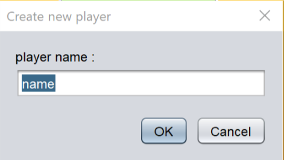
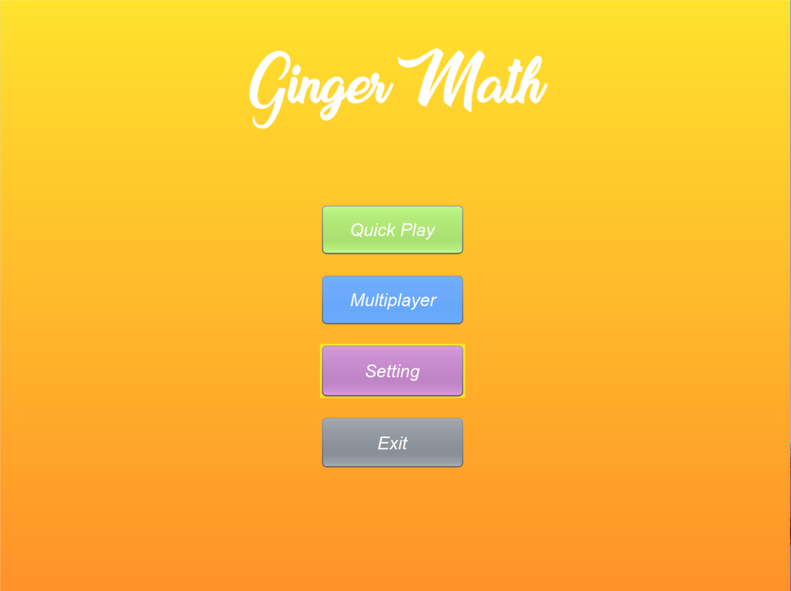
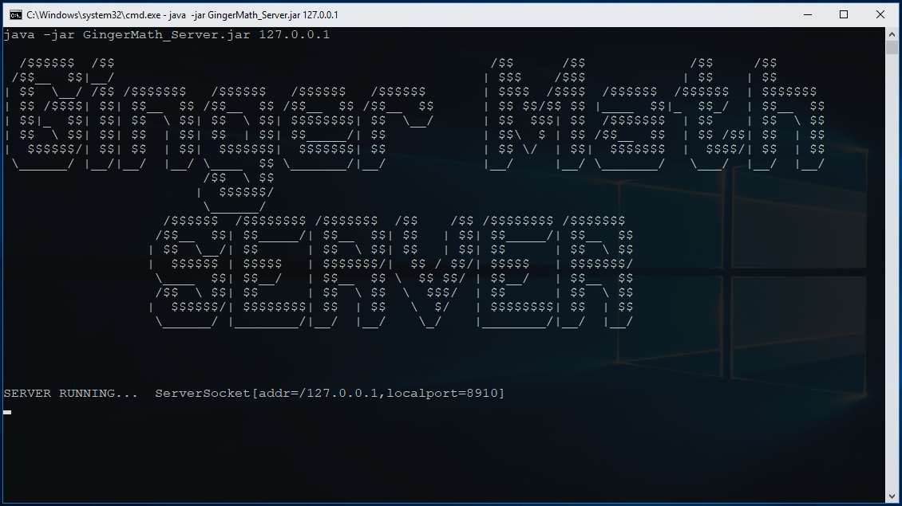
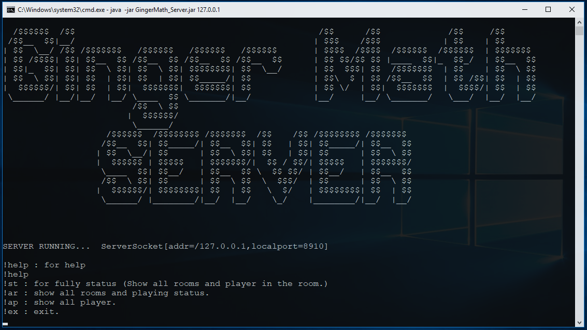

#  What is "Ginger Math" ?

&nbsp;&nbsp;&nbsp;&nbsp; Ginger Math เป็นแอพพลิเคชั่นเกมที่จะเปลี่ยนมุมมองในการคิดเลขเดิมๆ สู่มิติใหม่แห่งการคิดเลขที่สนุกยิ่งกว่า!

<br>

#  Welcome to New World.

&nbsp;&nbsp;&nbsp;&nbsp; เบื่อไหมกับการนั่งคิดเลขคนเดียวอย่างเหงาๆ ( อยู่อย่างคนเหงาๆ อยู่กับความเดียวดาย ~ ) Ginger Math จะพาคุณเข้าสู่โลกออนไลน์ ให้คุณได้สร้างเกมการแข่งขันกับผู้เล่นคนอื่นๆ

<br>

#   System Requirment
* Java 10 or greater

<br>

#  How to play

- Installation - ขั้นตอนการติดตั้ง
  - เริ่มต้นที่การติดตั้งแอพพลิเคชั่น GingerMath ง่ายๆ ด้วยการดาวน์โหลดไฟล์ .jar
  - เริ่มเล่นเกมด้วยการรันไฟล์ GingerMathGame.jar

* Let's get started - เริ่มต้นการใช้งาน
  - เริ่มเล่นเกมด้วยการรันไฟล์ GingerMathGame.jar

  <br>

  <p align=center></p>

  <br>

  - หลังจากรันโปรแกรมขึ้นมา จะมี Pop-up ให้ใส่ชื่อของผู้เล่น เพื่อที่จะทำการจัดเก็บข้อมูลของผู้เล่น(เก็บชื่อ และคะแนนสูงสุด)  เพื่อนำข้อมูลมาใช้ในการจัดทำอันดับคะแนน (Global Ranking)รวมไปถึงการเล่นโหมด Multiplayer เพื่อให้ผู้เล่นคนอื่นได้รู้ว่าคนที่มาเล่นด้วยชื่ออะไร 
  ``` โดยชื่อต้องมีความยาว2-10ตัวอัษรภาษาอังกฤษและไม่มีอักขระพิเศษและช่องว่าง ```
  
  <p align=center></p>
  
  - เมื่อเราทำการกรอกชื่อผู้เล่นและกด OK เรียบร้อยเรา ก็จะมาพบกันหน้า Main Menu ซึ่งจะมีหน้าตาเป็นตามรูปด้านล่างนี้
  <p align=center></p>
    - Quick Play เป็นโหมดเล่นคนเดียวแบบแข่งกับตัวเอง โดยผู้เล่นจะต้องพยายามตอบคำถามให้ได้มากที่สุดภายในเวลา 60 วินาที โดยที่คำถามนั้นจะเพิ่มจำนวนหลักและความยากขึ้นเรื่อยๆตามจำนวนข้อที่เราตอบถูก โดยเมื่อตอบถูกก็จะได้ 1 คะแนน ซึ่งตัวเลขในการเล่นแต่ละรอบนั้นจะไม่ซ้ำกัน จะมีการ Random เลขขึ้นมาใหม่ทุกครั้ง
    - Multiplayer เป็นโหมดการแข่งขันกับผู้เล่นคนอื่นๆ เราสามารถเล่นกับผู้เล่นคนอื่นๆได้สูงสุดถึง 4 คน โดยมีเวลาให้ 60 วินาทีเช่นเดียวกันกับโหมด Quick Play โดยที่โจทย์ของทุกๆคนจะได้รับโจทย์เหมือนกัน และเมื่อแข่งจบก็จะมีการสรุปคะแนนว่าใครเป็นผู้ชนะในการแข่งครั้งนั้นๆ
    - Setting เราสามารถเข้าไปตั้งค่า การเปิด/ปิดเสียงของเกม และ ขนาดของตัวโปรแกรม ( Window sizes )
    - Exit เอาไว้ใช้ในการออกจากแอพพลิเคชั่นเกม

* Go Online
    * ทำการคลิ๊กที่ปุ่ม multiplayer
    * จะเข้าสู่หน้า lobby ที่จะแสดงรายชื่อห้องที่พร้อมเข้าเล่น
    * กดเลือกห้องที่ต้องการ จากนนั้นกดปุ่ม JOIN ROOM หรือกด CREATE ROOM เพื่อสร้างห้อง
    * จะเข้าสู่ห้องเล่นเกม, ทำการรอผู้เล่นอื่นจนกระทั่งคนที่เป็นเจ้าของห้อง(หัวห้อง(คนที่สร้างห้อง)) กด START

<br>

#  For Advance User
&nbsp;&nbsp;&nbsp;&nbsp; สำหรับผู้ใช้ที่ที่ต้องการจะเปิดเซิฟเวอร์เกมบนเซิฟเวอร์ของตัวเองให้ทำการรันไฟล์ GingerMath_Server.jar ตามด้วย IP Address ของคุณ

```
java -jar GingerMath_Server.jar xx.xx.xx.xx
```
``` xx.xx.xx.xx. คือ IP Address ```

``` * โดยทางระบบจะทำงานอยู่ที่ port 8910 * ```

เมื่อรันแล้วจะได้


และสามารถดูสถานะของเซิร์ฟเวอร์ได้โดยพิมพ์คำสั่งที่ถูกกำหนดไว้ (พิมพ์ !help เพื่อดูคู่มือ)


<br>

#  Team Member

| <a href=""></a> | <a href=""></a> | <a href=""></a> |
| :---------------------------------------------------------: | :-----------------------------------------------------------: | :-------------------------------------------------------: |
|                    โฆษิต โฆษิตศรีคุณากร                     |                    ปิยะพล เพิ่มพงศ์ไพบูลย์                    |                     อุดมเอก ชุมทองมา                      |
|                          60070008                           |                           60070052                            |                         60070120                          |
|          [@KimKosit](https://github.com/KimKosit)           |           [@fpiyapol](https://github.com/fpiyapol)            |       [@158Alfetta](https://github.com/158Alfetta)        |

<br>

#   Instructor

||
|:-:|
| **ผศ.ดร. ธนิศา นุ่มนนท์** |

<br>

---


06016317 Object-Oriented Programming

Faculty of Information Technology

King Mongkut's Institute of Technology Ladkrabang

---

&copy; 2018 GingerMath, All Rights Reserved
